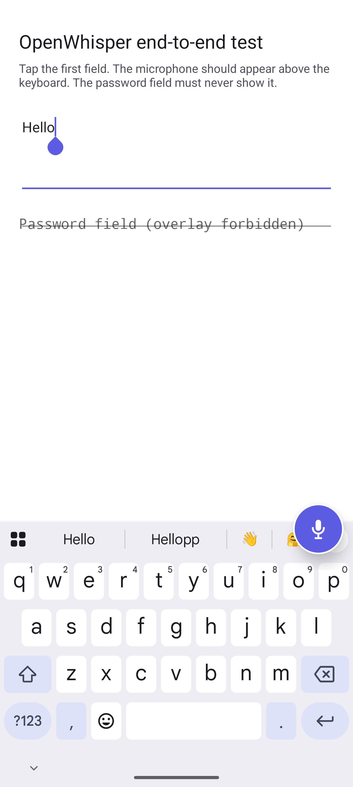
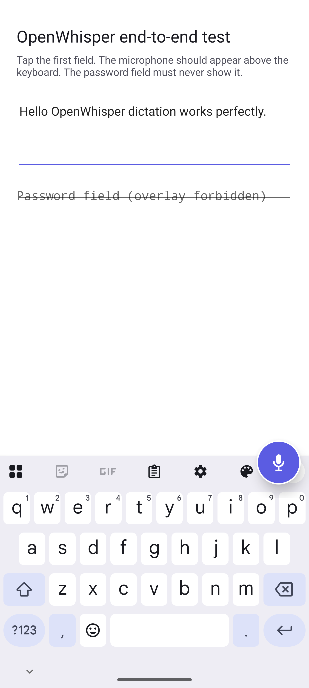
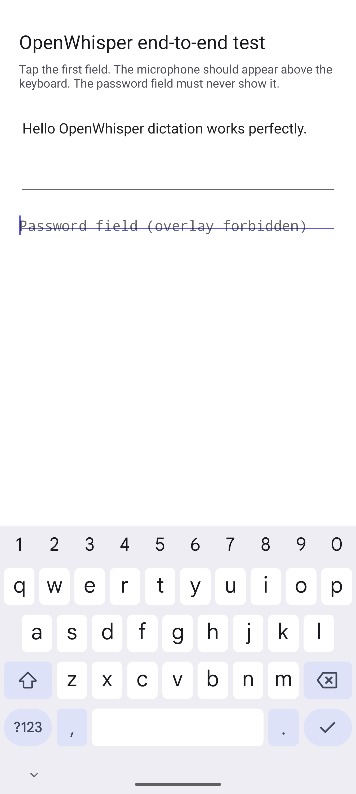

# Android companion

## What was built

OpenWhisper now has a native Kotlin Android app in `apps/android`, targeting
Android API 36 with a minimum of API 28. It does not replace or patch Samsung
Keyboard. Android has no supported extension point for injecting controls into
another vendor's IME. Instead, a user-enabled `AccessibilityService` owns a
small `TYPE_ACCESSIBILITY_OVERLAY` microphone that follows the active keyboard.

This gives the intended S26 Ultra experience while leaving Samsung Keyboard as
the selected IME:

1. Focus a normal editable field and let Samsung Keyboard appear.
2. OpenWhisper docks its mic over the keyboard's top-right edge.
3. Tap once to record and again to finish.
4. The transcript is inserted at the captured cursor or replaces only the
   captured selection.

The control is hidden when no keyboard is visible, focus is not editable, or
the platform marks a field as password/sensitive.







## Architecture and safety boundaries

- `OpenWhisperAccessibilityService` observes focus and IME windows, owns the
  overlay, and coordinates dictation.
- `EditorSessionController` snapshots stable editor identity, text, selection,
  password state, and sensitivity. Commit is refused if focus or content
  changed during dictation.
- `AndroidAudioRecorder` captures mono 16 kHz PCM and `WavEncoder` creates a WAV
  payload.
- `OpenAiHttpTranscriptionClient` sends multipart form data directly to
  `POST /v1/audio/transcriptions` using `gpt-4o-mini-transcribe`. This request
  shape and model are supported by the current
  [OpenAI transcription API reference](https://developers.openai.com/api/reference/resources/audio/subresources/transcriptions/methods/create).
- `SecureApiKeyStore` encrypts a user-supplied API key with AES-256-GCM using a
  non-exportable Android Keystore key. App backup and device transfer are
  disabled. This protects the key at rest, but a rooted/compromised phone is
  outside the threat model; a managed public release should use a server-side
  token broker instead of distributing an organization key to phones.
- The accessibility and app UI share one process so settings and encrypted
  credentials remain consistent. No transcript text is written to logs.

The debug build defaults to deterministic demo transcription, which requires
no microphone, key, network, or billable request. Turn that switch off in the
app to exercise live capture.

## Reproducible test environment

From a Windows PowerShell prompt at the repository root:

```powershell
.\scripts\bootstrap-android.ps1 -WithEmulator
.\scripts\test-android.ps1
```

The bootstrap is repository-local: Temurin JDK 17, the Android command-line
tools, API 36, build tools, Gradle, and a Pixel 9 Pro XL API 36 emulator are
stored below ignored `.tools` paths.

The test command performs a clean build and runs:

- JVM tests for cursor/selection preservation, password/sensitive rejection,
  stale focus/content rejection, overlay placement, state transitions,
  cancellation, error recovery, WAV encoding, multipart requests, response
  parsing, and microphone shutdown races;
- Android Keystore instrumentation tests proving encrypted round-trip, clear,
  and absence of plaintext in preferences;
- an offline end-to-end device test that enables the accessibility service,
  launches a real editable activity and software keyboard, finds and taps the
  actual overlay window, inserts the deterministic transcript, then proves the
  overlay disappears for a password field;
- Android lint and debug APK assembly.

Useful individual commands:

```powershell
.\scripts\android-emulator.ps1 start -Visible
.\scripts\android.ps1 testDebugUnitTest
.\scripts\android.ps1 connectedDebugAndroidTest
.\scripts\android.ps1 lintDebug assembleDebug
.\scripts\android-emulator.ps1 stop
```

## Install on a Galaxy S26 Ultra

The public beta is a signed, non-debuggable APK:

**[Download OpenWhisper-Android.apk](https://github.com/JamesHuckle/OpenWhisper/releases/latest/download/OpenWhisper-Android.apk)**

Download that file on the phone and open it from **My Files**. Samsung Auto
Blocker may need to be disabled temporarily under **Settings > Security and
privacy > Auto Blocker**. Allow the browser or My Files to install unknown apps
when prompted, then re-enable Auto Blocker after installation.

For a developer installation instead:

1. Build the debug APK with `.\scripts\android.ps1 assembleDebug`.
2. Enable Developer options and USB debugging on the phone.
3. Install with:

   ```powershell
   .\.tools\android-sdk\platform-tools\adb.exe install -r `
     .\apps\android\app\build\outputs\apk\debug\app-debug.apk
   ```

4. Open OpenWhisper and grant microphone and notification permissions.
5. Tap **Enable accessibility overlay**, select **OpenWhisper dictation**, read
   the Android warning, and enable it only if you accept the access described
   above.
6. Keep Samsung Keyboard selected. Leave deterministic demo enabled for the
   first acceptance pass; open the built-in end-to-end test screen and verify
   mic, insertion, and password suppression.
7. Save a personal OpenAI API key, disable demo mode, and repeat with live
   speech.

## Publish a signed GitHub release APK

The first release needs a persistent Android signing key:

```powershell
.\scripts\setup-android-signing.ps1
```

The keystore is created outside the repository at
`%USERPROFILE%\.openwhisper\android\openwhisper-release.jks`; its credentials
are stored in the ignored `.env`. Back up both securely. Losing the key makes
it impossible to publish an update that existing Android installations accept.

Build, sign, verify, upload, and re-download/verify the public asset with:

```powershell
.\scripts\release-android.ps1
```

Every release publishes both a versioned APK and the stable
`OpenWhisper-Android.apk` asset used by the latest-download URL.

The automated environment validates Android 16/API 36 framework behavior and a
real software IME. A physical S26 Ultra/One UI pass is still required before
claiming Samsung-specific release certification, particularly for keyboard
geometry, battery restrictions, microphone foreground-service behavior, and
rotation/multi-window layouts.

## APKs and reports

- Debug APK: `apps/android/app/build/outputs/apk/debug/app-debug.apk`
- Signed public APK: `apps/android/app/build/outputs/apk/public/OpenWhisper-Android.apk`
- JVM report: `apps/android/app/build/reports/tests/testDebugUnitTest/index.html`
- Device report: `apps/android/app/build/reports/androidTests/connected/debug/index.html`
- Lint report: `apps/android/app/build/reports/lint-results-debug.html`

See `docs/android-acceptance.md` for the release acceptance checklist.
